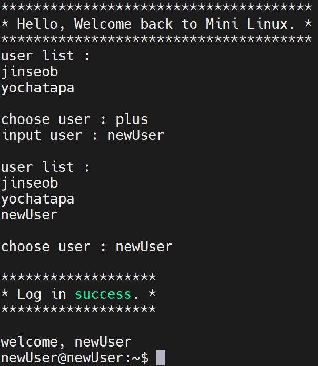

# dgu-ice-os-project

## 프로젝트 정보

동국대학교 컴퓨터공학부 정보통신공학전공
"운영체제" 과목 실습 과제

### 과제 : Mini Operating System을 구현하라. 

[상세 지침](./docs/GuideLine.md)

### Mini Operating System이란?

Mini Operating System은 다양한 자료구조를 활용하여 리눅스 CLI(Command Line Interface)를 클론 코딩하는 프로젝트입니다.
이 프로젝트에서는 ls, cd, mkdir, rm 등 주요 명령어를 직접 구현하며, 멀티프로세서를 설계하여 여러 명령어가 동시에 동작할 수 있도록 개발하는 것이 목표입니다.

<br>

### 기능 소개

Mini Operating System에는 다음과 같은 기능들이 구현되어 있습니다.

- 9가지 명령어 (14가지 옵션)
- 사용자 선택(로그인) 기능
- 멀티프로세싱을 이용하여 명령어 동시 실행

Mini Operating System의 명령어와 옵션에 대한 설명은 다음과 같습니다.

#### 기본 명령어 (6개)
- [cd](./docs/cd/README.md) : 현재 작업 디렉토리를 변경합니다.
- [mkdir](./docs/mkdir/README.md) : 새 디렉토리를 생성합니다.
    - m 옵션 : 생성하는 디렉토리의 권한을 설정합니다.
    - p 옵션 : 중간 디렉토리가 없는 경우 중간 디렉토리까지 함께 생성합니다.
- [pwd](./docs/pwd/README.md) : 현재 작업 중인 디렉토리의 절대 경로를 출력합니다.
- [ls](./docs/ls/README.md) : 현재 디렉토리의 파일과 디렉토리를 나열합니다.
    - a 옵션 : 숨김 파일을 포함한 모든 파일을 표시합니다.
    - l 옵션 : 파일의 상세 정보(권한, 크기, 수정 날짜 등)를 표시합니다.
    - la, al 옵션 : 숨김 파일과 상세 정보를 모두 표시합니다.
- [cat](./docs/cat/README.md) : 파일 내용을 출력하거나 파일을 생성/합칩니다.
    - \> 옵션 : 파일의 내용을 덮어씁니다.
    - n 옵션 : 출력 시 줄 번호를 표시합니다.
- [rm](./docs/rm/README.md) : 파일이나 디렉토리를 삭제합니다.
    - r 옵션 : 디렉토리를 포함한 하위 파일까지 모두 삭제합니다.

#### 추가 명령어 (3개)
- [tree](./docs/tree/README.md) : 디렉토리 구조를 트리 형태로 표시합니다.
    - a 옵션 : 숨김 파일을 포함한 모든 파일을 표시합니다.
    - f 옵션 : 파일의 전체 경로를 표시합니다.
    - p 옵션 : 각 파일/디렉토리의 권한을 표시합니다.
- [rmdir](./docs/rmdir/README.md): 빈 디렉토리를 삭제합니다.
    - p 옵션: 하위 디렉토리를 포함한 경로를 모두 삭제합니다.
- [find](./docs/find/README.md) : 파일이나 디렉토리를 검색합니다.
    - name 옵션 : 파일 이름을 기준으로 검색합니다.
    - type 옵션 : 파일 유형(예: 파일, 디렉토리)을 기준으로 검색합니다.

<br>

### 시스템 구조

Mini Operating System의 구조는 다음과 같습니다.

```
root 디렉토리
├─ 사용자1 디렉토리
│  ├─ ...
├─ 사용자2 디렉토리
│  ├─ ...
```

각 디렉토리/파일은 다음 정보를 포함하고 있습니다.

- type : 폴더인지 파일인지 나타냄
- permission : 폴더 또는 파일의 권한을 나타냄
- user : 폴더 또는 파일의 소유자를 나타냄
- group : 폴더 또는 파일의 소유 그룹을 나타냄
- time : 폴더 또는 파일이 생성된 시간을 나타냄
- name : 폴더 또는 파일의 이름을 나타냄
- lchild : 폴더의 하위 폴더를 나타냄
- lsibling : 폴더와 같은 깊이에 있는 트리 중 왼쪽에 있는 트리를 나타냄
- rsibling : 폴더와 같은 깊이에 있는 트리 중 오른쪽에 있는 트리를 나타냄
- previous : 상위 폴더를 나타냄

<br>

### How To Use

1. src 폴더에 있는 main.c를 다운받습니다.
2. 실행시킬 `Linux` 환경에 `main.c`를 위치시킵니다.
3. main.c를 컴파일해줍니다.
```sh
    gcc -std=c99 -o 실행파일명 main.c
```
4. 실행파일을 실행시켜줍니다.
```sh
    ./실행파일명
```

5. 정상 작동되었다면 다음과 같은 이미지가 표출됩니다. input user에 사용자 이름을 입력한 후 enter 키를 눌러주세요.
    
<br>
6. 사용할 user를 선택해주세요.
    

    <br>

    user를 추가하고 싶다면, plus를 입력해주세요.
    

<br>

7. 로그인이 정상적으로 완료되면, Mini Operating System을 사용할 수 있습니다!
    